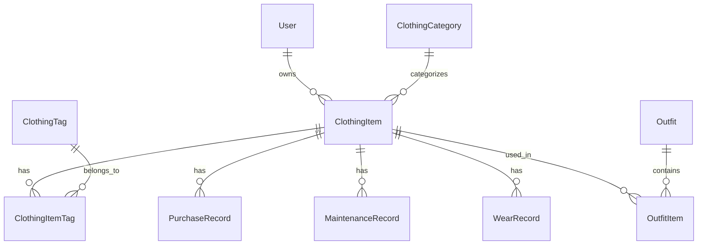

# 衣物资产管理系统架构设计

## 概述

本文档描述了衣物资产管理系统的完整架构设计，包括数据模型、业务逻辑、API接口等核心组件。

## 系统特性

### 核心功能
- ✅ 衣物资产管理（增删改查）
- ✅ 多维度标签系统（季节、场合、风格、颜色、材质、品牌）
- ✅ 衣物分类管理（层级结构）
- ✅ 穿着记录追踪
- ✅ 保养记录管理
- ✅ 购买记录管理
- ✅ 耐久度计算算法
- ✅ 统计分析功能

### 高级功能
- 🔄 智能推荐系统
- 🔄 成本效益分析
- 🔄 舒适度分析
- 🔄 保养提醒系统
- 🔄 批量操作
- 🔄 数据导入导出

## 数据模型设计

### 核心实体

#### 1. ClothingItem (衣物)
```go
type ClothingItem struct {
    ID                  uint
    UserID              uint
    CategoryID          uint
    Name                string
    Brand               string
    Color               string
    Size                ClothingSize
    Material            string
    Price               float64
    PurchaseDate        *time.Time
    Condition           ClothingCondition
    WearCount           int
    DurabilityScore     float64
    LastWornDate        *time.Time
    SpecificAttributes  SpecificAttributes
    ImageURLs           []string
    Notes               string
    IsActive            bool
    IsFavorite          bool
}
```

#### 2. ClothingCategory (衣物分类)
```go
type ClothingCategory struct {
    ID          uint
    Name        string
    Description string
    ParentID    *uint
    Parent      *ClothingCategory
    Children    []ClothingCategory
    Icon        string
    Color       string
    SortOrder   int
    IsActive    bool
}
```

#### 3. ClothingTag (衣物标签)
```go
type ClothingTag struct {
    ID          uint
    Name        string
    Type        TagType // season, occasion, style, color, material, brand, custom
    Description string
    Color       string
    Icon        string
    IsSystem    bool
    IsActive    bool
    SortOrder   int
    UserID      *uint
}
```

#### 4. 生命周期管理

**PurchaseRecord (购买记录)**
```go
type PurchaseRecord struct {
    ID              uint
    ClothingItemID  uint
    PurchasePrice   float64
    OriginalPrice   float64
    Discount        float64
    StoreName       string
    PurchaseDate    time.Time
    PaymentMethod   string
    ReceiptURL      string
    WarrantyPeriod  int
    WarrantyExpiry  *time.Time
    Notes           string
}
```

**MaintenanceRecord (保养记录)**
```go
type MaintenanceRecord struct {
    ID                  uint
    ClothingItemID      uint
    MaintenanceType     MaintenanceType
    Cost                float64
    MaintenanceDate     time.Time
    ServiceProvider     string
    BeforeCondition     ClothingCondition
    AfterCondition      ClothingCondition
    EffectivenessScore  int
    NextMaintenanceDate *time.Time
    Notes               string
}
```

**WearRecord (穿着记录)**
```go
type WearRecord struct {
    ID               uint
    ClothingItemID   uint
    WearDate         time.Time
    DurationHours    int
    Occasion         string
    WeatherCondition string
    Temperature      float64
    Activity         string
    ComfortRating    int
    StyleRating      int
    WearIntensity    string
    Notes            string
}
```

### 关系设计



## 业务逻辑层

### 耐久度计算算法

```go
func (c *ClothingItem) CalculateDurability() float64 {
    baseScore := 100.0
    
    // 穿着磨损 = 穿着次数 × 磨损系数
    wearDamage := float64(c.WearCount) * c.getWearDamageRate()
    
    // 时间磨损 = (当前时间 - 购买时间) × 时间磨损系数
    timeDamage := c.getTimeDamage()
    
    // 保养加分 = 保养次数 × 保养效果系数
    maintenanceBonus := c.getMaintenanceBonus()
    
    // 材质系数
    materialFactor := c.getMaterialDurabilityFactor()
    
    durability := (baseScore - wearDamage - timeDamage + maintenanceBonus) * materialFactor
    
    return math.Max(0, math.Min(100, durability))
}
```

### 标签系统设计

#### 标签类型
- **季节标签**: 春季、夏季、秋季、冬季
- **场合标签**: 休闲、正式、运动、派对、工作、约会、旅行
- **风格标签**: 简约、复古、街头、优雅、运动风、商务、甜美、朋克
- **颜色标签**: 基础色、亮色、暗色、中性色
- **材质标签**: 棉质、丝质、羊毛、皮革、牛仔、聚酯纤维
- **品牌标签**: 奢侈品牌、快时尚、设计师品牌、运动品牌
- **自定义标签**: 用户自定义

#### 标签管理
- 系统预设标签：不可删除，全局可用
- 用户自定义标签：用户私有，可增删改
- 标签统计：使用频率、关联衣物数量

## API接口设计

### RESTful API 端点

#### 衣物管理
```
POST   /api/clothing/items           # 创建衣物
GET    /api/clothing/items           # 获取衣物列表
GET    /api/clothing/items/:id       # 获取单个衣物
PUT    /api/clothing/items/:id       # 更新衣物
DELETE /api/clothing/items/:id       # 删除衣物
```

#### 统计分析
```
GET    /api/clothing/stats           # 获取衣物统计
GET    /api/clothing/analytics/*     # 各种分析接口
```

#### 分类和标签
```
GET    /api/clothing/categories      # 获取分类列表
GET    /api/clothing/categories/tree # 获取分类树
GET    /api/clothing/tags           # 获取标签列表
GET    /api/clothing/tags/:type     # 按类型获取标签
```

#### 记录管理
```
POST   /api/clothing/items/:id/wear        # 记录穿着
POST   /api/clothing/maintenance/items/:id # 添加保养记录
POST   /api/clothing/purchases/items/:id   # 添加购买记录
```

### 请求/响应格式

#### 创建衣物请求
```json
{
  "category_id": 1,
  "name": "白色T恤",
  "brand": "Uniqlo",
  "color": "白色",
  "size": {
    "size": "M",
    "system": "CN"
  },
  "material": "棉质",
  "price": 99.00,
  "purchase_date": "2024-01-15T00:00:00Z",
  "condition": "new",
  "specific_attributes": {
    "sleeve": "短袖",
    "neckline": "圆领",
    "fit": "标准"
  },
  "image_urls": ["https://example.com/image1.jpg"],
  "notes": "基础款白T恤",
  "tag_ids": [1, 5, 8]
}
```

#### 衣物响应
```json
{
  "id": 1,
  "user_id": 1,
  "category_id": 1,
  "category": {
    "id": 1,
    "name": "T恤",
    "parent_name": "上衣"
  },
  "name": "白色T恤",
  "brand": "Uniqlo",
  "color": "白色",
  "durability_score": 95.5,
  "wear_count": 3,
  "cost_per_wear": 33.00,
  "tags": [
    {
      "id": 1,
      "name": "夏季",
      "type": "season",
      "color": "#FFD700"
    }
  ],
  "created_at": "2024-01-15T10:30:00Z"
}
```

## 技术栈

### 后端
- **语言**: Go 1.21+
- **框架**: Gin
- **ORM**: GORM
- **数据库**: PostgreSQL
- **认证**: JWT
- **日志**: slog

### 前端 (计划)
- **框架**: React + TypeScript
- **构建工具**: Vite
- **UI库**: Ant Design / Material-UI
- **状态管理**: Redux Toolkit / Zustand
- **HTTP客户端**: Axios

## 部署架构

```
┌─────────────────┐    ┌─────────────────┐    ┌─────────────────┐
│   Frontend      │    │   Backend       │    │   Database      │
│   (React)       │◄──►│   (Go/Gin)      │◄──►│  (PostgreSQL)   │
│   Port: 3000    │    │   Port: 8080    │    │   Port: 5432    │
└─────────────────┘    └─────────────────┘    └─────────────────┘
```

## 数据库初始化

系统启动时自动执行：
1. 数据库表结构迁移
2. 系统预设分类数据初始化
3. 系统预设标签数据初始化

## 安全考虑

- JWT认证保护所有API端点
- 用户数据隔离（通过user_id）
- 输入验证和数据清理
- SQL注入防护（GORM自动处理）
- 文件上传安全检查

## 性能优化

- 数据库索引优化
- 分页查询
- 缓存策略（Redis）
- 图片压缩和CDN
- API响应压缩

## 扩展性设计

- 微服务架构准备
- 插件系统设计
- 多租户支持
- 国际化支持
- 移动端API兼容

## 开发状态

### 已完成 ✅
- [x] 数据模型设计
- [x] 数据库迁移配置
- [x] 系统预设数据初始化
- [x] DTO结构定义
- [x] Repository接口设计
- [x] Service接口设计
- [x] Controller基础实现
- [x] 路由配置
- [x] 耐久度计算算法

### 进行中 🔄
- [ ] Repository实现
- [ ] Service实现
- [ ] 完整的Controller实现
- [ ] 单元测试

### 计划中 📋
- [ ] 前端界面开发
- [ ] 集成测试
- [ ] 性能测试
- [ ] 部署配置
- [ ] 文档完善

## 下一步计划

1. **实现Repository层**: 完成数据访问层的具体实现
2. **实现Service层**: 完成业务逻辑层的具体实现
3. **完善Controller**: 添加错误处理、验证等
4. **编写测试**: 单元测试和集成测试
5. **前端开发**: React界面开发
6. **系统集成**: 前后端集成测试

---

*文档版本: v1.0*  
*最后更新: 2024-08-14*